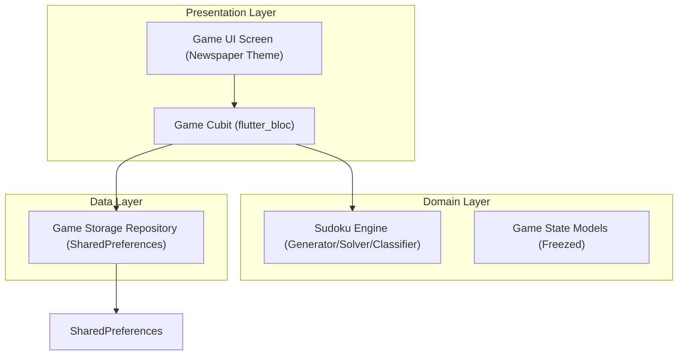

# Spec: Newspaper Sudoku Architecture & Implementation Plan — Phase 1: MVP

## Objective
To build a high-fidelity, distraction-free Sudoku game for hardcore players, designed with a vintage print newspaper aesthetic (Light Mode only). The application features completely offline, high-speed puzzle generation, human-like logical difficulty classification, strict mistake/limit constraints tailored by difficulty, toggleable note/pencil mark capabilities, limited hint mechanisms, and a bulletproof auto-save feature.

---

## Users / Audience
*   **Target User**: Hardcore Sudoku players who want high-contrast, distraction-free solving, offline functionality, and extreme challenge (Expert mode, 0-tolerance for errors).

---

## Tech Stack & Architecture

### Core Tech Stack (Installed & Verified)
*   **Framework**: Flutter (iOS & Android) - SDK: `^3.11.5`
*   **State Management**: **Cubit** via `flutter_bloc: ^9.1.1` and `bloc_test: ^10.0.0` for unit tests.
*   **Dependency Injection**: `get_it: ^9.2.1` for global service registration.
*   **Local Storage**: `shared_preferences: ^2.5.5` for auto-saves and `flutter_secure_storage: ^10.2.0` for potential future secure storage.
*   **Networking**: `dio: ^5.9.2` (registered as core baseline, though the app is completely offline).
*   **Serialization**: `freezed_annotation: ^3.1.0` & `json_annotation: ^4.12.0` with codegen `freezed: ^3.2.5`, `json_serializable: ^6.14.0`, and `build_runner: ^2.15.0`.
*   **Logging**: `logger: ^2.7.0` for structured console reporting.
*   **Mocking/Testing**: `mocktail: ^1.0.5` for mock interfaces.
*   **Routing**: `go_router: ^17.2.3` for clean page transitions.
*   **Aesthetics/Styling**: Custom theme attributes styled directly using **Google Stitch MCP** to achieve vintage newspaper paper texture, precise print margins, and ink-like border styling.

---

## System Architecture & Module Breakdown

We adhere to standard **Clean Architecture** patterns separated by domain, data, and presentation boundaries to support testability.

### 1. Domain Module (Core Sudoku Logic)
*   **`SudokuEngine`**: Backtracking solver, irregular generator, and logical human-like solver classifier.
    *   Generates full valid 9x9 grids.
    *   Removes numbers to match the target difficulty.
    *   **Logical Solver**: Runs a logical solver applying cascading techniques (Singles -> Pairs/Intersections -> Triples/Quads -> Fish/Wings) to classify the puzzle difficulty precisely.
    *   Verifies that the generated puzzle has a **single, unique solution** (via a fast backtracking count).
*   **`SudokuBoard` / `SudokuCell` Models**:
    *   Immutable `Freezed` models capturing `originalClue`, `currentDigit`, `Set<int> pencilMarks`, and coordinates `(row, col)`.
    *   Full `GameState` capturing overall board status, mistakes made, hints remaining, timer seconds, active selection, and current difficulty.

### 2. Data Module (Persistence)
*   **`SudokuStorageRepository`**:
    *   Interfaces with `shared_preferences`.
    *   Saves the complete JSON serialized `GameState` block on every valid move or note toggled.
    *   Loads and restores state on application launch.

### 3. Presentation Module (State & UI)
*   **`GameCubit`**:
    *   Manages user input (tapping cells, toggling notes mode, adding/removing notes, entering digits, using hints, pausing/resuming).
    *   Interacts with `SudokuEngine` to create new games.
    *   Trigger automatic saves via `SudokuStorageRepository`.
    *   Maintains the game loop timer.
*   **Sudoku Board & Grid View**:
    *   Newspaper print style UI.
    *   High-contrast ink grid lines (thick grid outer borders, thinner interior box grids).
    *   Elegant typography representing paper texture.
    *   Light Mode only.

---

## Testing Strategy
1.  **Unit Tests**:
    *   **`SudokuEngine` (Backtracking Solver, Logical Solver, Generator)**: Assert unique solutions, ensure generator creates boards adhering strictly to clue count & correct difficulty level techniques, ensure performance.
    *   **`GameCubit`**: Test cell editing, mistake limit thresholds (instant loss on Expert's 1st mistake), note toggling, and decrementing hint limitations.
2.  **Widget & Integration Tests**:
    *   Verify the Sudoku 9x9 grid layout renders cleanly.
    *   Simulate a game session, pause it, exit, reload, and verify all board values and notes are perfectly restored.

---

## Commands
*   **Build & Code-gen**: `dart run build_runner build --delete-conflicting-outputs`
*   **Run App**: `flutter run`
*   **Run Tests**: `flutter test`
*   **Code Linting**: `flutter analyze`

---

## Boundaries & Constraints
*   **Always**: Keep puzzle generation entirely offline.
*   **Never**: Include banner ads, colorful modern animations, or flashy popups. Everything must look printed on vintage paper.
*   **Never**: Build light mode with generic solid blue or green colors. The palette must consist of tailored, warm off-white paper tones, carbon/ink grays, and precise line textures.
