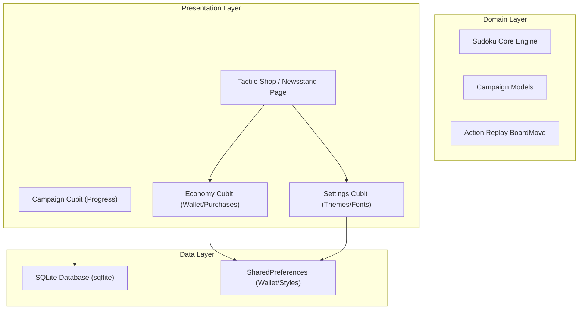

# Spec: Newspaper Sudoku Architecture & Database Schema — Phase 2: Gamification

## Objective
To extend the distraction-free newspaper Sudoku app with a complete classic-journalism themed gamification economy (Ink Droplets), a progression-based Campaign system ("The Editorial Journey"), selectable Daily Challenges ("The Daily Edition"), selective memory-optimized solve replay logs ("The Press Archives"), and dynamic print-styling customization within a warm Dark Newsprint environment.

---

## Technical Stack Expansion
*   **Database Persistent Layer**: SQLite via `sqflite: ^2.3.0` & `path: ^1.9.0` for structured tables (campaign levels, calendar challenges, and large compressed action logs).
*   **State Customizer**: Seamless Cubit state broadcasts using `flutter_bloc` to rebuild layouts instantly upon custom color, typography, or theme changes.
*   **Data Models**: Lightweight JSON arrays stored directly to local tables for minimized database footprint.

---

## System Architecture & Module Breakdown

We maintain rigid **Clean Architecture** boundaries, adding state controls for customizations and persistence layers.



### 1. Presentation Themes & State Management
*   **`SettingsCubit`**:
    *   Manages active publisher name `username` (defaulting to `"User"`), loaded/saved to Preferences.
    *   Coordinates the warm Dark Newsprint theme mode toggle.
    *   Broadsides custom typography font family (Georgia, Garamond, Courier) and active print inks.
*   **`EconomyCubit`**:
    *   Tracks the user's Ink Droplet balance (💧).
    *   Maintains lists of unlocked premium styling fonts and inks.
    *   Handles store purchase verification: deducting droplets and unlocking items.
*   **`CampaignCubit`**:
    *   Manages the state of the three preset campaign volumes and tracks which levels are solved/unlocked.
    *   Triggers grand droplet rewards upon complete volume solving.

### 2. Technical Data Layer & Persistence Models

#### A. Database (SQLite) Schema — `sudoku_database.dart`
To handle 100 levels per volume and replay logs efficiently without bloating Preferences, a local SQLite database contains three main tables:

```sql
-- Tracks completed campaign stages
CREATE TABLE campaign_progress (
    volume_id TEXT NOT NULL,
    level_index INTEGER NOT NULL,
    is_completed INTEGER DEFAULT 0,
    best_time INTEGER,
    unlocked_at INTEGER,
    PRIMARY KEY (volume_id, level_index)
);

-- Store selective user solves compressed as action-logs
CREATE TABLE press_archives (
    id TEXT PRIMARY KEY,
    title TEXT NOT NULL,
    difficulty TEXT NOT NULL,
    date_timestamp INTEGER NOT NULL,
    solve_duration_seconds INTEGER NOT NULL,
    log_payload TEXT NOT NULL -- Compressed JSON action array
);

-- Tracks unlocked Daily Challenges calendar dates
CREATE TABLE daily_calendar (
    challenge_date TEXT PRIMARY KEY, -- "YYYY-MM-DD"
    difficulty TEXT NOT NULL,
    solve_time INTEGER NOT NULL,
    reward_earned INTEGER NOT NULL
);
```

#### B. Action Replay Model Schema — `board_move.dart`
An immutable model mapping each chronological user grid interaction (entries, note markups, undos, and durations) compressed to tight JSON arrays to ensure storage optimization:
```dart
class BoardMove {
  final int timestampOffsetMs; // Relative to start of game
  final int row;
  final int col;
  final int val;
  final bool isNote;
  final bool isUndoAction;
  
  const BoardMove({
    required this.timestampOffsetMs,
    required this.row,
    required this.col,
    required this.val,
    required this.isNote,
    this.isUndoAction = false,
  });
}
```

---

## Visual & UX Constraints
*   **AAA High Contrast Guidelines**: Ensure active status indicators on buttons remain completely readable (e.g. using contrast color `0xFF1E2022` in dark theme) against light background badges.
*   **Lock Verification**: Locked items in the shop must display with a `🔒` padlocked symbol and their UI selection controls must remain disabled until unlocked by spending accumulated droplets.
*   **Clean Context Trees**: Avoid placing state selectors directly in scrollable list viewbuilders to prevent KeepAlive/Sliver exceptions. Use child `Builder` leaf contexts.
